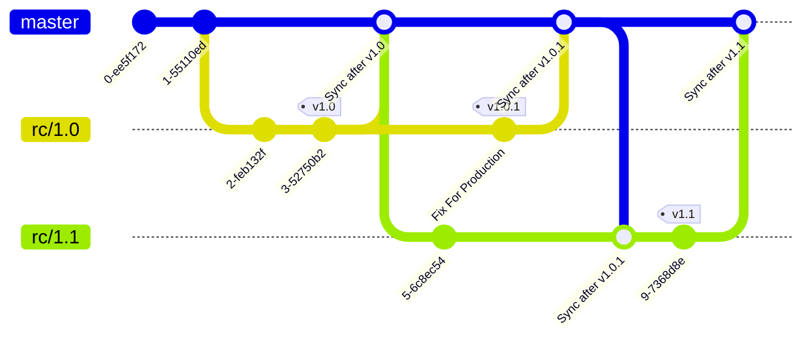
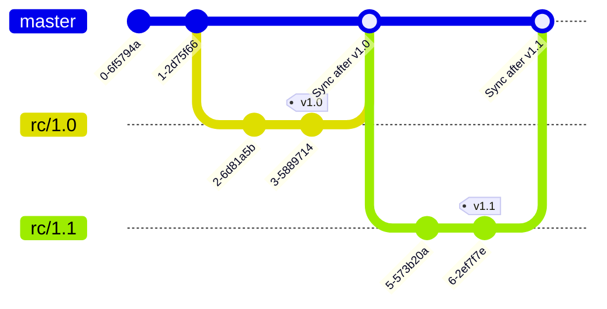

```mermaid
%%{init: { 'gitGraph': {'mainBranchName': 'master'}}}%%
gitGraph
    commit
    commit
    branch rc/1.0
    checkout rc/1.0
    commit
    commit tag:"v1.0"
    checkout master
    merge rc/1.0 id:"Sync after v1.0"
    branch rc/1.1
    checkout rc/1.1
    commit
    checkout rc/1.0
    commit id:"Fix For Production" tag:"v1.0.1"
    checkout master
    merge rc/1.0 id:"Sync after v1.0.1"
    checkout rc/1.1
    merge master id:"Sync after v1.0.1 "
    commit tag:"v1.1"
    checkout master
    merge rc/1.1 id:"Sync after v1.1"
```

```mermaid
%%{init: { 'gitGraph': {'mainBranchName': 'master'}}}%%
gitGraph
    commit
    commit
    branch rc/1.0
    checkout rc/1.0
    commit
    commit tag:"v1.0"
    checkout master
    merge rc/1.0 id:"Sync after v1.0"
    branch rc/1.1
    checkout rc/1.1
    commit
    commit tag:"v1.1"
    checkout master
    merge rc/1.1 id:"Sync after v1.1"
```